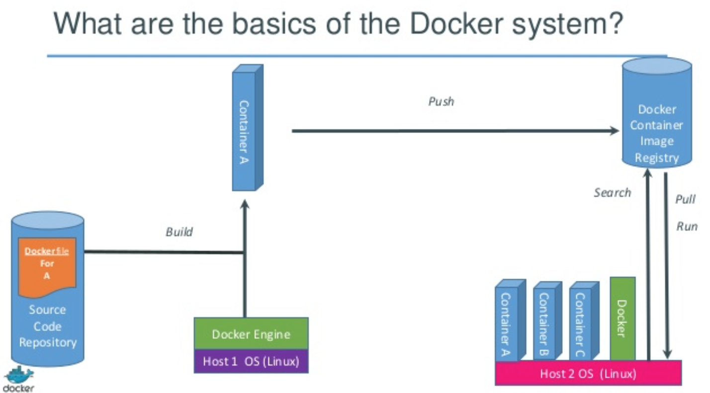
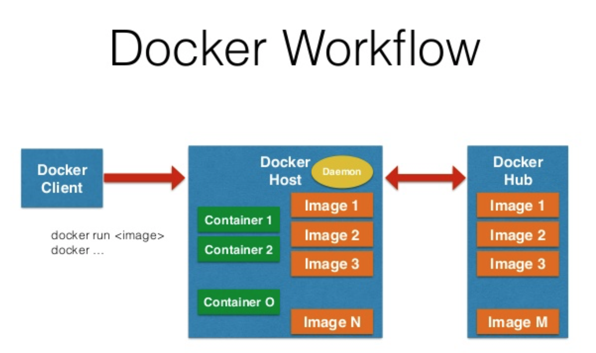
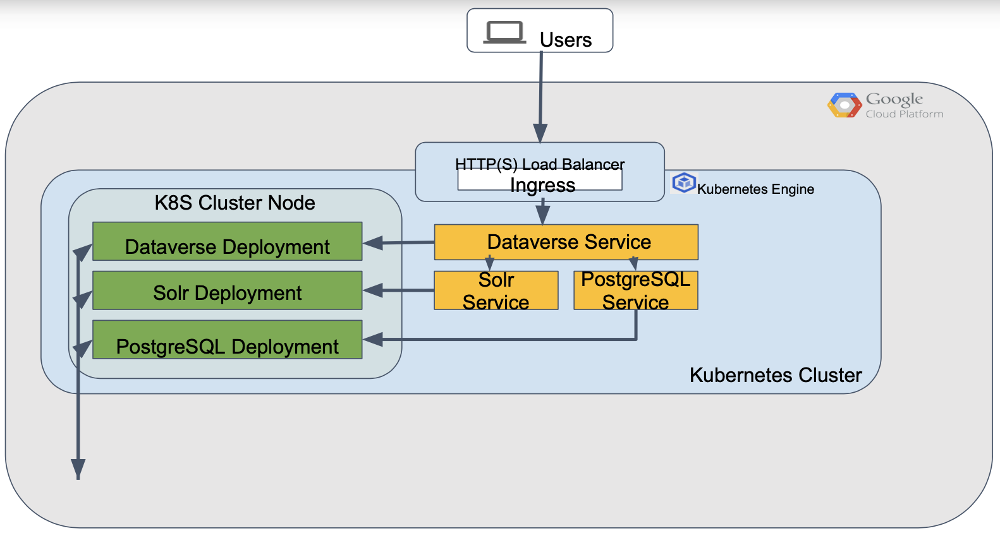

# Docker and Kubernetes infrastructure for Dataverse

## Introduction

Docker is a really interesting and innovative technology. For software developers there is the most compelling reason to use Docker because it helps to solve this particular problem of making all of their environments much more consistent. If you’re using Docker, you build once and run anywhere, on any OS. 

The central concept in Docker is this idea of a software container. When we have this container the developer or sysadmin can wire up everything inside that container exactly the way he wants. Developer can install all operating system level dependencies, like which version of Java he wants, or some Python dependencies, or he can install application source code. It’s very important: wherever Docker goes, whether it's another developer's machine, a server in our office, a server in the cloud, it's going to behave the exact same way. 

When most people hear about Docker for the first time, they try and compare it to an existing tool that they already use. Some people think it's like a virtualization tool like VMware Virtual Box, some people might think it's a VM manager like Vagrant. Other people compare it to configuration management tools like Ansible that DANS is using. 

According to Docker company itself, Docker is an open application for developers and sysadmins to build, ship and run distributed applications. Docker is more like VMs but has a minimal overhead. 

When a developer spins up a new instance, in the cloud or on a new server, he will get access to that server, run all the commands in the right sequence to configure his application, all of its dependencies, all the operating system level dependencies. 

When it’s done, the application is ready to go to production as the infrastructure will remain the same. Docker solves a problem of a lack of reproducibility. When a developer or sysadmin spins up that next server, he is a human who can make a mistake. So the conventional solution to this problem for the past years has been configuration management tools like Ansible (used by DANS). When you're using these tools, you just define a desired end state for your server using their specific configuration language. When a developer or sysadmin points those tools at a new server, they go off and configure everything automatically. And so these tools are great because it means once we've done the work to configure one server, it's much easier for us to take that work and apply it to subsequent servers, like to build a distributed network of Dataverses. But they all have the catch that you have to learn their specific technology, you have to know how to write an Ansible playbook to make them work. 

Picture 1. Docker images and containers

When a developer needs to spin up a new server, he still has to wait for that configuration management tool to run and do all this work before he can actually get in there and use it all the way. Traditional virtual machines are most portable but have lots of overhead. VMs are the best choice if you know that wherever they run, they are going to behave the exact same way because they look like they are a full real computer. They're completely isolated from their host operating system.The virtual machines disk image size is the same disk image that you would need. 

If you were installing a server on a hard drive locally it can take a long time to boot up, the more services are running on them, time will increase. Docker containers are much smaller than traditional virtual machines, and they can start much faster. 

Docker also opens up really interesting new possibilities for how DANS developers can spin up applications. Docker operates like any traditional virtual machine, where you have server hardware at the bottom and a host operating system above that. And then there's a hypervisor layer like VirtualBox or VMware, which is using the computing power of your server to provide virtual hardware that is then consumed by a guest operating system. And that guest operating system is where you, as the developer, install all of the dependencies for your application. 

VMs are great for isolation of all software packages, but have redundant operating systems. We're running a host operating system and a guest operating system, and paying twice to Vancis. In contrast, with Docker, the stack looks a lot shorter and thus cheaper. We still have our server hardware and our host operating system on the bottom but instead of the hypervisor layer, we have the Docker engine. Docker engine is relying on Open Source components and set of installation instructions in the special file called Dockerfile in order to build Docker images and run software containers, which are in essence, smart enough to leverage the components of the host operating system to create what looks like a fully isolated virtual guest operating system for the applications that you run inside it. 

## Comparison of workflows: traditional DANS pipeline vs Docker

We have a few possible workflows at DANS for the deployment of the Dataverse application. First, using just traditional workflow, maybe with a Ansible configuration management tool, and then using Docker containers. So to kind of set the scene, we have four different components in DataverseNL setup. Our system has a glassfish web application, SOLR search engine. It uses a Postgres database on the back end, and it's served up on the front end with apache for reverse proxy. 

Usually, a DANS developer writes some new code for commits, pushes it up to our git repo, and the master branch will get the most recent commit that the developer just pushed up. After that, our build server comes into action, pulls down that latest code and runs our test suite. And then if the pipeline passes, it will go on a server. Or if it's on a pull request, the dev team indicates the pull request is good to merge. One thing that's already kind of tricky about this situation is that you might not unless you're very careful, you might not have the same version of Postgres running in both of those environments. And this is especially tricky if you're working with a configuration that was provided by a third party (e.g. the dataverse Community) because understanding what exactly it does is far from trivial. 

Picture 2. Docker workflow based on Docker Hub registry 

To update a Dataverse application deployed on a VM, someone from the dev or admin team would SSH into our server, deploy a new code and restart all the services. So in this workflow, the update process is running separately in all VMs (test, acceptance and production), and thus the Dataverse application should be tested again after applying changes. With Docker, the workflow looks a little bit different. There is an important component called the Docker registry. And on our development machine, we're running all three components of our stack. And we're not just running those little white circle processes, right on our native VM, we're running them inside Docker containers. 

So we have a box, a Docker container for each process in our stack. And that's sort of a rule of thumb when you start working with Docker is one process per container. So let's see how our workflow looks a little bit different now that we're using Docker. When we have new code, a Dataverse developer would still push it up to GitHub, that's just the same, our get repo would update with the latest commits on our master branch, our build server would leap into action and pull down that latest code. But then when it finishes the build, it's still gonna probably put that green dot back to GitHub to let everybody know that everything's okay. 

But it's also going to produce something new called a Docker image. And it can push that Docker image up to the Docker registry. That could be the Docker Hub, which is the Docker registry that the IQSS team maintains, or it could be DANS internal Docker registry, depending on the DANS policy.  For SSHOC project it was decided to host its own Docker Registry in CESSDA Cloud to make it more sustainable even for test/acceptance purposes. If we're going to implement Jenkins pipeline for CI/CD, there is no difference where to publish Docker images, both options should be supported.
This Docker image represents not just a snapshot of your code at a point in time, like a git commit does, but also a snapshot of the entire OS, the entire environment that the application was running in. And so that is the artifact that you can be confident will behave the exact same way in production as it did on your build server. So now when we go to deploy to production, we'll see that, again, all of our processes are running inside containers. And instead of reaching out to our get server to pull down our latest code, we're reaching out to the Docker registry to pull down the latest full good image of our code and the environment it ran in, and we're going to stop current Docker container and spin up a new container in the production environment based on that Docker image. If we'll do it in the Kubernetes environment we'll get no service downtime as a load balancer will schedule all traffic load to other running containers.

Docker Images define how you store your application as safe isolated environments between different servers. On picture 1 all these boxes are Docker containers in our development machine, we're running a container for each process. On the build server, we're running a container for each process. In production, we are running a container for each process. But the Docker image is how we propagate new changes between all those environments. So when you start working with Docker yourself, the first thing you need to do before you can take an application and put it inside the Docker container is to create a Dockerfile.

Dockerfile is a special file that lives together with your source code, which basically tells Docker how to create a Docker image for your software applications. Some people do describe them as almost glorified bash scripts with a couple extra special special commands. So all the way at the top, each Docker image has to start from a base image. And in this case, Dataverse image is just a plain kind of stripped down installation of the Ubuntu Linux distribution.

After that, three commands should be executed to install glassfish, Postgres and SOLR, and then Docker can expose which port is the relevant port (8080 for web server) from containers that are created from this image. It will specify Docker what command it should run by default when it creates new containers from this image. There is a Docker library, which is a collection of official images maintained by Docker and other open source projects for almost every kind of programming language or server appliance you can imagine. So there's one for Python, there's one for Ruby, Java, PHP, there's also ones for Postgres MySQL, Redis, memcached nginx, Apache, etc. It allows extending a basic functionality with external applications connected to Dataverse.

There are more and more images being added all the time in Docker Hub. These Docker library images provide a base image that already has Postgres installed, for example. All of these images come with some extra commands built into them to help you configure your application. So when you use the Python on build base image, it's very easy to start with Docker even for people without any Docker experience with a software application in two lines of code because Docker will look for requirements txt file in your repository, copy it into the container, install your requirements, then look for source code in the directory that's alongside your Docker file copy all of that into the container, and you're ready to go. 

## Virtual Machines vs Docker Containers 

For practical reasons, it’s important to understand the difference between VMs and Docker. First of all, Docker containers are not virtual machines. Docker containers are more a sort of lightweight or trimmed down virtual machine. The comparison made sense because Dockers heavily leaned on it as something that uses less memory and starts much faster than virtual machines. There are a lot of comparisons to VMs but it all begins with some type of infrastructure.

This could be some laptop, desktop computer, a dedicated server running in a data center, or a virtual private server that you're using in the cloud, such as Amazon ECS. When we're talking about VMs, this is commonly labeled as the host operating system usually called the hypervisor. You can think of virtual machines as a self contained computer packed into a single file but something needs to be able to run that file. That's where a hypervisor comes into play. And there's two types of hypervisors: first are “type one” hypervisors that can interface directly with your infrastructure as hardware. The other is a “type two” hypervisor which runs as an application on top of your host operating system.

For example, “type one” of hypervisors would be hyper kit on Mac OS, Hyper V on Windows, or on Linux. Two popular “type two” hypervisors are VirtualBox and VMware. Usually “type one” hypervisors are more efficient, because they can bypass the host OS and interact directly with the hardware of your server. “Type two” hypervisors are still very efficient and can be used as infrastructure. 

The next layer are your guest operating systems. If someone wants to run three applications on your server in total isolation that would require spinning up three guest operating systems, which are all controlled by your hypervisor. They could all be the same guest OS or different. But the problem here is that each guest OS in itself might start from 700MB each.

It means 2.1Gb of disk space should be used just for guest operating systems. Each guest OS needs its own CPU and memory resources. Additionally on top of that, each guest OS needs its own copy of various binaries and libraries to lay the groundwork down for whatever your application needs to run. For example, you might need a Dataverse application installed so that your web applications library for connecting to Postgres service can connect to Postgres database. We need to install Java packages required for the Glassfish web server. 

If we want each Dataverse app to be isolated, we would need to run each one inside of its own guest OS, in fact it’s happening with test, development and production Dataverse servers, or virtual machines on a server. 

If we compare that to Docker, we still need some type of infrastructure to run them, like VMs. This could be any laptop or a server somewhere out there in the cloud, doesn’t matter. We need our host operating system, this could be anything that's capable of running Docker. By the way, all major distributions of Linux are supported and there are ways to run Docker on Mac OS and Windows. However, Docker requires Linux kernel to run on Windows VM, in the same time Docker daemon replaces the hypervisor. The Docker daemon is a service that runs in the background on the host OS and manages everything required to run and interact with Docker containers. 

Just like on Virtual machines but instead of them being run on a guest OS, they get built into Docker images. Docker daemon runs those images. Each application and service (glassfish with Dataverse app, SOLR and Postgres) should be kept in its own Docker image, and will be managed independently by the Docker daemon. Typically each application and its library dependencies get packed into the same Docker image to make the application isolated. If Docker will be used for running infrastructure, we don't need to run any type of hypervisor or virtual machine. Instead, the Docker daemon communicates directly with the host operating system, and knows how to manage all resources for the running Docker containers. 

Docker containers can be started in a few milliseconds. It can also save a ton of disk space and other system resources due to not needing to lug around a bulky guest OS for each application that we need to run. There's also no virtualization needed with Docker since it runs directly on the host OS.  

Virtual machines are very good at isolating system resources, and entire working environments. For example, if you owned a web hosting company, you would likely use virtual machines to separate each customer. On the flip side, Docker's philosophy is to isolate individual applications, not entire systems. A great example of this would be breaking up a bunch of web apps into their own Docker images.

## Dataverse Docker infrastructure concerns
 
There are some Docker specific issues that should be considered before making decision to go with Dataverse on Docker infrastructure:
1. Docker images should be maintained separately, even security updates definitely would lead to the release of new images. It means sysadmin(s) should be doing maintenance on the regular basis in the same way as for VM instances.
2. Persistent volumes with data files should be covered by a backup strategy. It should be possible to recover files from this backup if the Dataverse application crashes and loses content for some reason, during hardware or software fault.
3. Some updates of versions of software packages in a Docker image can break the Dataverse application. That means Dataverse should be tested carefully after every update. To improve this situation we've started to develop a Selenium based Dataverse Test Suite that should be able to test the Dataverse app automatically with CI/CD pipeline.
4. Test plan should include tools like Selenium to automate testing after every upgrade and bug fixing.
 
Application specific issues include maintenance of all components of Dataverse: Glassfish web application, Postgres database and SOLR search engine.
1. The Dataverse application should be tested again after every update of a Docker image. It’s quite a common situation that after an OS update some functionality will stop working and the application should also be upgraded to become compliant with installed packages.
2. The Dataverse image should be rebuilt and tested every time after a new version is released.
3. Dataverse images should also be updated and redeployed when users report new bugs and when developers release patches Dataverse images also should be updated and redeployed again.
4. SOLR search engine running in different container and should be also upgraded time after time, both software and schema (with Dataverse updates)
5. Database (postgres) is a separate image and should be tested in order to check compliance with its data from the previous version.

## Building Microservices for Dataverse

Microservice is a useful concept to talk againsts of a big monolith web application that just does everything. Dataverse is based on microservices and split it up into a handful of other products, a handful of other processes. Different business logic functions like authentication or logging or user management, a very specific thing that can be put into its own application, it’s all examples of microservices. And those different microservices can communicate through HTTP protocol and be exposed from Docker on different ports.

This is essentially the difference between a monolithic architecture and a microservices architecture that is valid for Dataverse. 
  

Picture 3. Dataverse deployment on Kubernetes in microservices framework

## Docker to Kubernetes path

There are a lot of discussions if we need to start with Docker or Kubernetes right now. One of the problems is Microsoft subscription for Azure Cloud, it’s going to expire at the end of June and (it seems) there is no way to prolong it. Another problem is the actual experience of developers, only a few people from the development team had to work with Docker, Jenkins and Kubernetes in EU projects. It’s going to be a very long learning curve if we follow this path right now.

However, the good thing about the Docker implementation is that we can start to work on it right now and use the same infrastructure both in the development and production. Technically it’s going to be exactly the same environment as all packages and software in Docker images should be identical. The maintenance of Docker images could be done in the central repository and the same image can be distributed for the development, test and production purposes. Docker setup could be implemented even on the current VMs with CentOS. But instead of having software installed and maintained separately inside of servers, we can have all images running with Docker Compose and available for test and production purposes, basically all people from the development team can run the same software.

Later on, even if it will take some time to figure out how to continue with Cloud setup, we can upgrade the initial Docker Compose infrastructure and go to Kubernetes setup. It means that the same Docker images can be used for the new Dataverse installation to make all infrastructure components reusable.

The major difference between Docker and Kubernetes infrastructures lies in the scalability and maintenance of the services. In the case of Docker DANS probably needs a dedicated person that will monitor the state of services and restart them if they go down and crash for some reason. At the same time Kubernetes does this job automatically and with usage of ingress services can schedule the load between all nodes running the same application(s). It’s not a problem if some of the nodes will be down and will be not available for some reason as Kubernetes can restart Docker containers automatically, without the help of a human operator. This Cloud functionality can also do a healthy check after the application will be redeployed, it’s reliable and can save a lot of time of people responsible for the same kind of work, and will help to provide much more stable and mature services out-of-the-box. In the end it can free up a lot of development resources currently busy with maintenance.

If we really need to be prepared for the future, it’s very important to get Jenkins pipeline working in the CI/CD setup, just a necessary step in the increasing of the maturity of Docker setup. The idea that we should get webhooks installed on our Dataverse github repository and CI/CD process should be able to clone, rebuild, deploy and test Dataverse application and other components. In can be done with Selenium tests by uploading the same sample datasets already provided by Dataverse community.

## Serverless

The biggest problem with Kubernetes, it’s a mature but at the same time quite complicated technology, DevOps need to get a lot of expertise in house to maintain it properly. To avoid the complexity, a lot of people started to move to Serverless framework, it’s very simple and supported by most Cloud providers like AWS, Azure and GCP.   

The Serverless Applications deployed on them are fundamentally zero-administration and scale automatically with demand, which eliminates the need to manage server instances at all (reference).  Serverless it considered as a new "big thing" for the future of services, something definitely to consider switching right now. More information about the Serverless.
