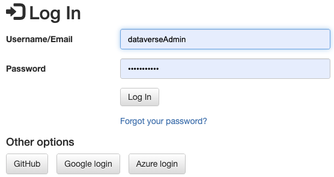
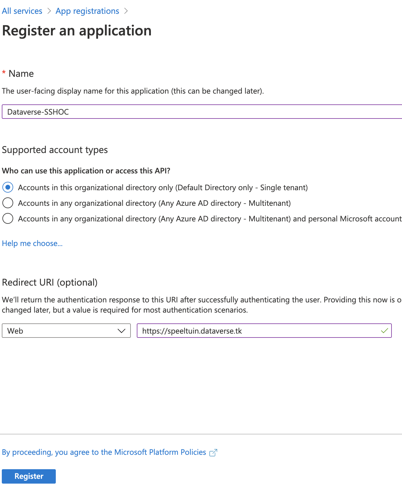

# Setup Dataverse Multi-login 
In general, the following steps have to be completed:

1. Setup the login access from provider

2. Create json file that contains the configuration

3. Ingest the json file to API endpoint: 
```
curl -X POST -H 'Content-type: application/json; charset=utf-8' --upload-file google-speeltuin.json http://localhost:8080/api/admin/authenticationProviders
```


## Github




Use this json file with own credentials:
```
{
        "id":"github",
        "factoryAlias":"oauth2",
        "title":"GitHub",
        "subtitle":"",
        "factoryData":"type: github | userEndpoint: NONE | clientId: 3***************8 | clientSecret: 1d60*********************f43",
        "enabled":true
}
```

## Google


https://console.developers.google.com/apis/credentials


  


  

  


json file:
```
{
        "id":"google",
        "factoryAlias":"oauth2",
        "title":"Google",
        "subtitle":"",
        "factoryData":"type: google | userEndpoint: NONE | clientId: 7dsfjdshjfhdjskhfjkdhsa.apps.googleusercontent.com | clientSecret: hkjfsldkjflksdflkca",
        "enabled":true
}
```

## Microsoft Azure


  


  


  


  

  


  


json file:
```
{
  "id":"microsoft",
  "factoryAlias":"oidc",
  "title":"Azure login",
  "subtitle":"a subtitle - currently unused in UI",
  "factoryData":"type: oidc | issuer: https://login.microsoftonline.com/{tenant}/v2.0 | clientId: 45************01 | clientSecret: oit**********6k",
  "enabled":true
}
```

### Google


json file:

```
{
  "id":"google",
  "factoryAlias":"oidc",
  "title":”Google lofin",
  "subtitle":"a subtitle - currently unused in UI",
  "factoryData":"type: oidc | issuer: https://accounts.google.com/ | clientId: 7********.apps.googleusercontent.com | clientSecret: h*********a",
  "enabled":true
}
```

### EGI Check-in integration


Authenticate at EGI and create an account there (use your Google, ORCID or GitHub account for test): https://aai-dev.egi.eu/registry/


Create OpenID Client by filling form in the dashboard:
  

Create json file and get clientid and clientSecret from EGI Check-In dashboard:
```
{
    "id":"egi",
    "factoryAlias":"oidc",
    "title":"EGI Check-in",
    "subtitle":"",
    "factoryData":"type: oidc | issuer: http://aai-dev.egi.eu/oidc/ | clientId: dansdvn | clientSecret: AI1A4NrNki98DzuY9RHMEBJs9I_F3Ce5OjLTHlm2Nrr_gIxCe7Fnu5xVhXALC3M0WlB6096ztCn8yvIGuifQXeI",
    "enabled":true
}
```
Upload this file to Dataverse configuration:
```
curl -X POST -H 'Content-type: application/json; charset=utf-8' --upload-file /tmp/egi.json http://localhost:8080/api/admin/authenticationProviders|more
```


## ORCID


  

  


json file:

```
 {
    "id":"orcid-sandbox",
    "factoryAlias":"oauth2",
    "title":"ORCID",
    "subtitle":"",
    "factoryData":"type: orcid | userEndpoint: https://api.sandbox.orcid.org/v2.0/{ORCID}/person | clientId: APP-*****FN | clientSecret: e9b*****90",
    "enabled":true
}
```
