<html><head><meta content="text/html; charset=UTF-8" http-equiv="content-type"></head><body class="c15"><h2 class="c13" id="h.fdumutg7otvs">Setup Dataverse Multi Login</h2>
In general, the following steps have to be completed:
<ol class="c7 lst-kix_uztqosgwwicp-0 start" start="1"><li class="c1 c4 li-bullet-0">Setup the login access from provider</li><li class="c1 c4 li-bullet-0">Create json file that contains the configuration</li><li class="c1 c4 li-bullet-0">Ingest the json file to API endpoint: </li></ol>
curl -X POST -H &#39;Content-type: application/json; charset=utf-8&#39; --upload-file google-speeltuin.json http://localhost:8080/api/admin/authenticationProviders

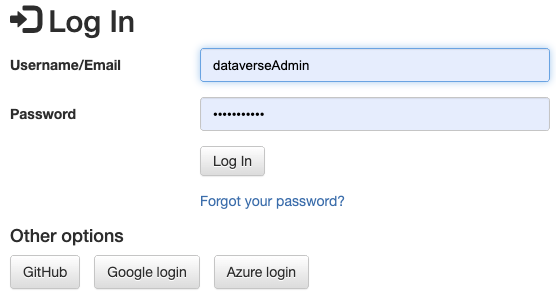

Github

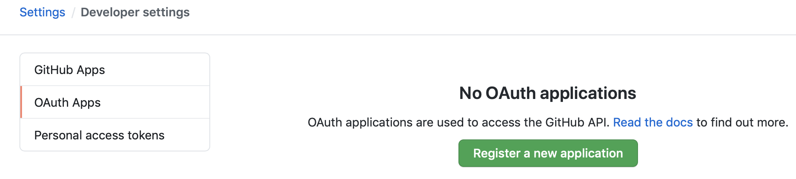

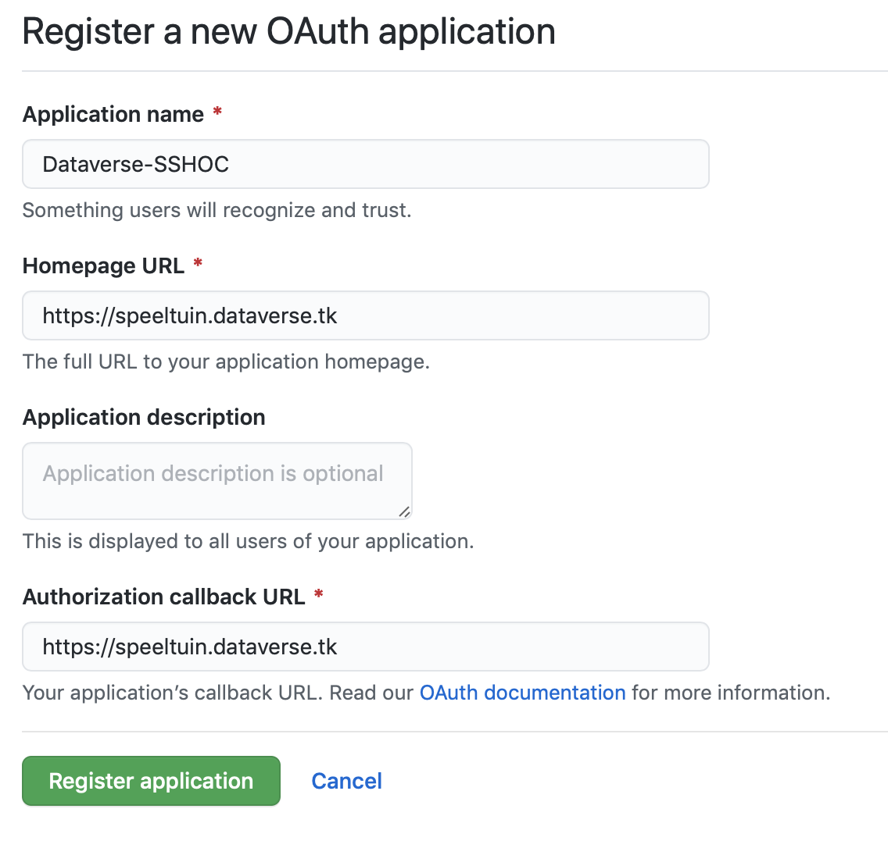

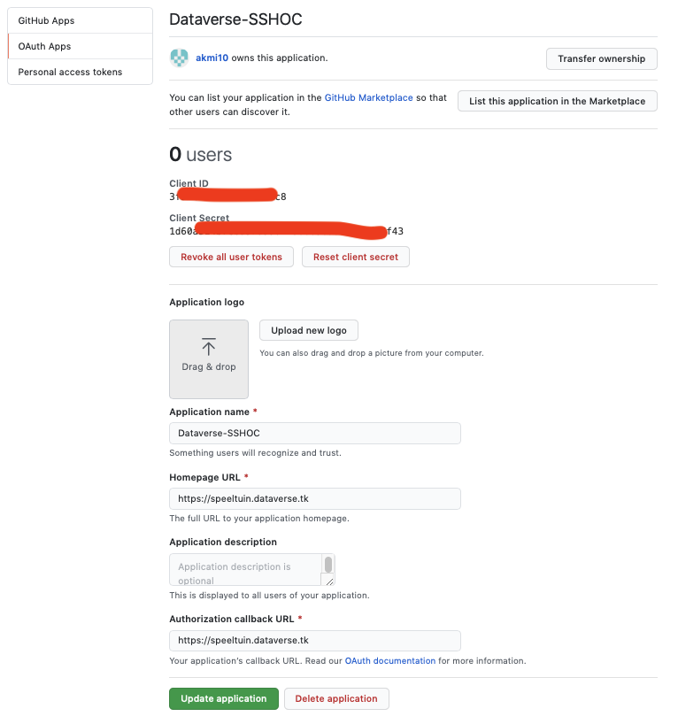

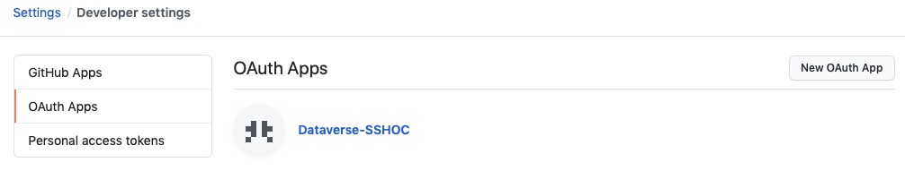

json file:

{

&nbsp;&nbsp;&nbsp;&nbsp;&nbsp;&nbsp;&nbsp;&nbsp;&quot;id&quot;:&quot;github&quot;,

&nbsp;&nbsp;&nbsp;&nbsp;&nbsp;&nbsp;&nbsp;&nbsp;&quot;factoryAlias&quot;:&quot;oauth2&quot;,

&nbsp;&nbsp;&nbsp;&nbsp;&nbsp;&nbsp;&nbsp;&nbsp;&quot;title&quot;:&quot;GitHub&quot;,

&nbsp;&nbsp;&nbsp;&nbsp;&nbsp;&nbsp;&nbsp;&nbsp;&quot;subtitle&quot;:&quot;&quot;,

&nbsp;&nbsp;&nbsp;&nbsp;&nbsp;&nbsp;&nbsp;&nbsp;&quot;factoryData&quot;:&quot;type: github | userEndpoint: NONE | clientId: 3***************8 | clientSecret: 1d60*********************f43&quot;,

&nbsp;&nbsp;&nbsp;&nbsp;&nbsp;&nbsp;&nbsp;&nbsp;&quot;enabled&quot;:true

}

Google

<a class="c9" href="https://www.google.com/url?q=https://console.developers.google.com/apis/credentials/oauthclient?project%3Dpivotal-shield-90009%26folder%3D%26organizationId%3D&amp;sa=D&amp;source=editors&amp;ust=1625496879058000&amp;usg=AOvVaw0AO3phTsSR6Ab_Bl2PDxPP">https://console.developers.google.com/apis/credentials</a>

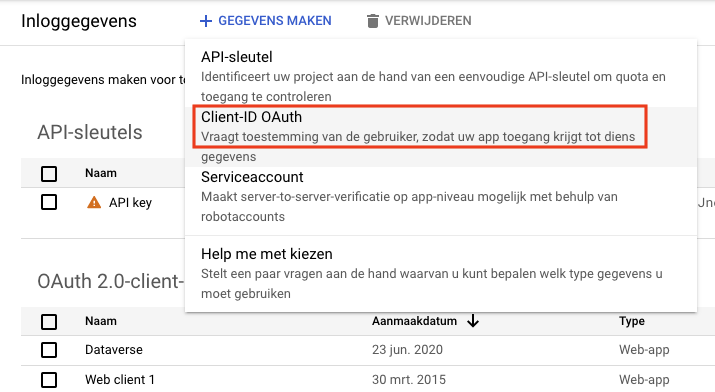

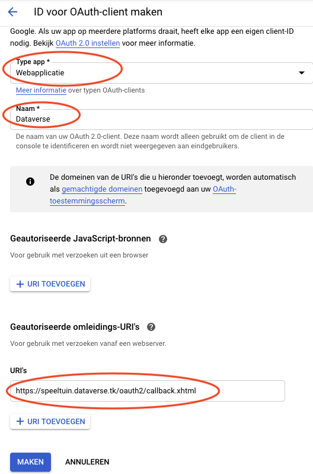

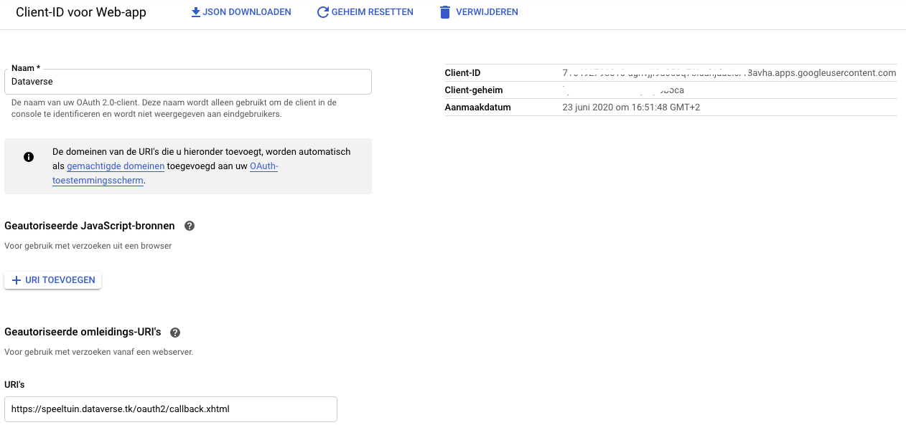

json file:

{

&nbsp;&nbsp;&nbsp;&nbsp;&nbsp;&nbsp;&nbsp;&nbsp;&quot;id&quot;:&quot;google&quot;,

&nbsp;&nbsp;&nbsp;&nbsp;&nbsp;&nbsp;&nbsp;&nbsp;&quot;factoryAlias&quot;:&quot;oauth2&quot;,

&nbsp;&nbsp;&nbsp;&nbsp;&nbsp;&nbsp;&nbsp;&nbsp;&quot;title&quot;:&quot;Google&quot;,

&nbsp;&nbsp;&nbsp;&nbsp;&nbsp;&nbsp;&nbsp;&nbsp;&quot;subtitle&quot;:&quot;&quot;,

&nbsp;&nbsp;&nbsp;&nbsp;&nbsp;&nbsp;&nbsp;&nbsp;&quot;factoryData&quot;:&quot;type: google | userEndpoint: NONE | clientId: 7dsfjdshjfhdjskhfjkdhsa.apps.googleusercontent.com | clientSecret: hkjfsldkjflksdflkca&quot;,

&nbsp;&nbsp;&nbsp;&nbsp;&nbsp;&nbsp;&nbsp;&nbsp;&quot;enabled&quot;:true

}

Microsoft Azure

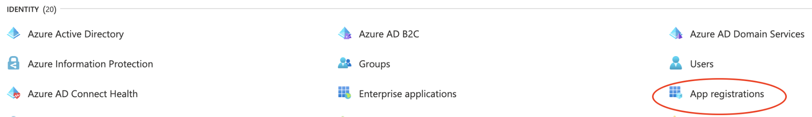

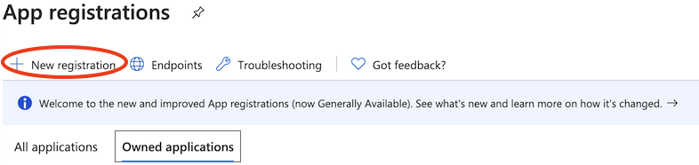

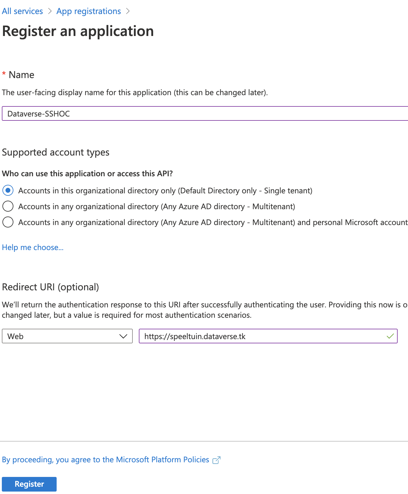

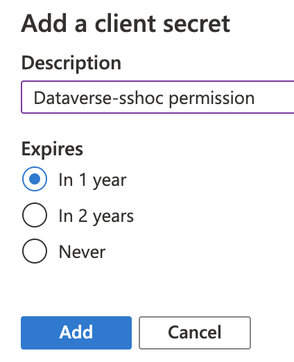

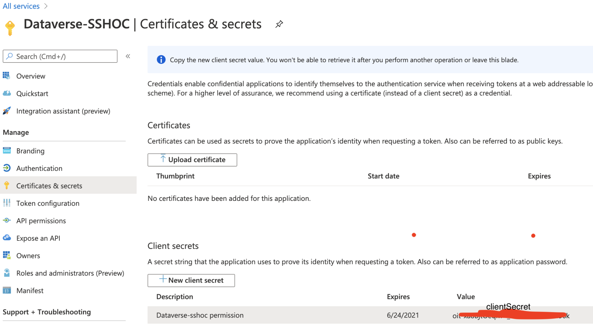

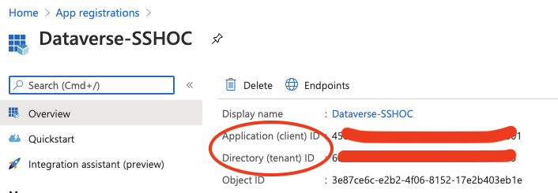

json file:

{

&nbsp; &quot;id&quot;:&quot;microsoft&quot;,

&nbsp; &quot;factoryAlias&quot;:&quot;oidc&quot;,

&nbsp; &quot;title&quot;:&quot;Azure login&quot;,

&nbsp; &quot;subtitle&quot;:&quot;a subtitle - currently unused in UI&quot;,

&nbsp; &quot;factoryData&quot;:&quot;type: oidc | issuer: https://login.microsoftonline.com/{tenant}/v2.0 | clientId: 45************01 | clientSecret: oit**********6k&quot;,

&nbsp; &quot;enabled&quot;:true

}

Google

json file:

{

&nbsp; &quot;id&quot;:&quot;google&quot;,

&nbsp; &quot;factoryAlias&quot;:&quot;oidc&quot;,

&nbsp; &quot;title&quot;:&rdquo;Google lofin&quot;,

&nbsp; &quot;subtitle&quot;:&quot;a subtitle - currently unused in UI&quot;,

&nbsp; &quot;factoryData&quot;:&quot;type: oidc | issuer: https://accounts.google.com/ | clientId: 7********.apps.googleusercontent.com | clientSecret: h*********a&quot;,

&nbsp; &quot;enabled&quot;:true

}

EGI Check-in integration

Authenticate at EGI and create an account there (use your Google, ORCID or GitHub account for test): <a class="c9" href="https://www.google.com/url?q=https://aai-dev.egi.eu/registry/&amp;sa=D&amp;source=editors&amp;ust=1625496879063000&amp;usg=AOvVaw0YH3YH7yhRtkJ11maXKod-">https://aai-dev.egi.eu/registry/</a>

Create OpenID Client by filling form in the dashboard:

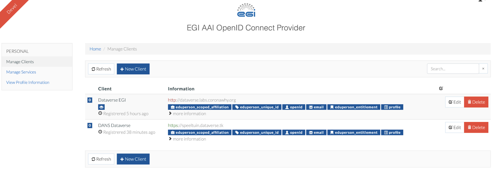

Create json file and get clientid and clientSecret from EGI Check-In dashboard:

{

&nbsp; &nbsp; &quot;id&quot;:&quot;egi&quot;,

&nbsp; &nbsp; &quot;factoryAlias&quot;:&quot;oidc&quot;,

&nbsp; &nbsp; &quot;title&quot;:&quot;EGI Check-in&quot;,

&nbsp; &nbsp; &quot;subtitle&quot;:&quot;&quot;,

&nbsp; &nbsp; &quot;factoryData&quot;:&quot;type: oidc | issuer: http://aai-dev.egi.eu/oidc/ | clientId: dansdvn | clientSecret: AI1A4NrNki98DzuY9RHMEBJs9I_F3Ce5OjLTHlm2Nrr_gIxCe7Fnu5xVhXALC3M0WlB6096ztCn8yvIGuifQXeI&quot;,

&nbsp; &nbsp; &quot;enabled&quot;:true

}

Upload this file to Dataverse configuration:

curl -X POST -H &#39;Content-type: application/json; charset=utf-8&#39; --upload-file /tmp/egi.json http://localhost:8080/api/admin/authenticationProviders|more

ORCID

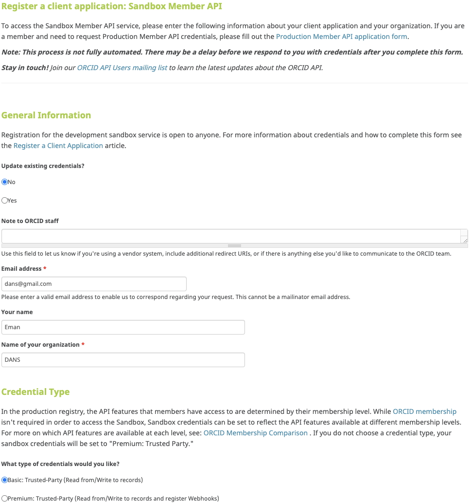

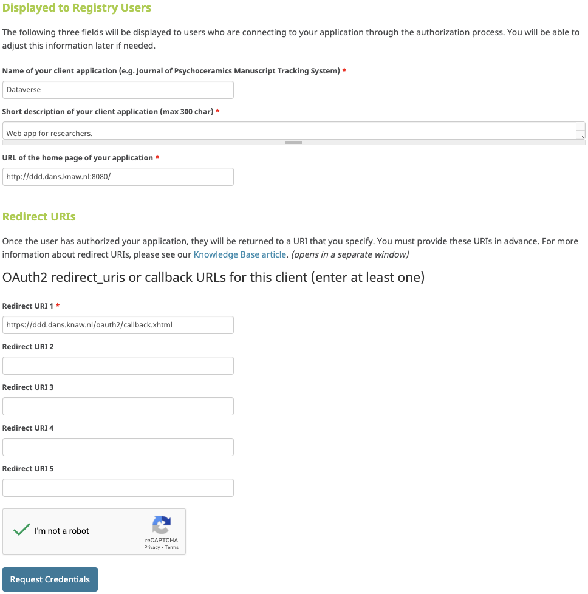

json file:

&nbsp;{

&nbsp; &nbsp; &quot;id&quot;:&quot;orcid-sandbox&quot;,

&nbsp; &nbsp; &quot;factoryAlias&quot;:&quot;oauth2&quot;,

&nbsp; &nbsp; &quot;title&quot;:&quot;ORCID&quot;,

&nbsp; &nbsp; &quot;subtitle&quot;:&quot;&quot;,

&nbsp; &nbsp; &quot;factoryData&quot;:&quot;type: orcid | userEndpoint: https://api.sandbox.orcid.org/v2.0/{ORCID}/person | clientId: APP-*****FN&nbsp;| clientSecret: e9b*****90&quot;,

&nbsp; &nbsp; &quot;enabled&quot;:true

}

</body></html>